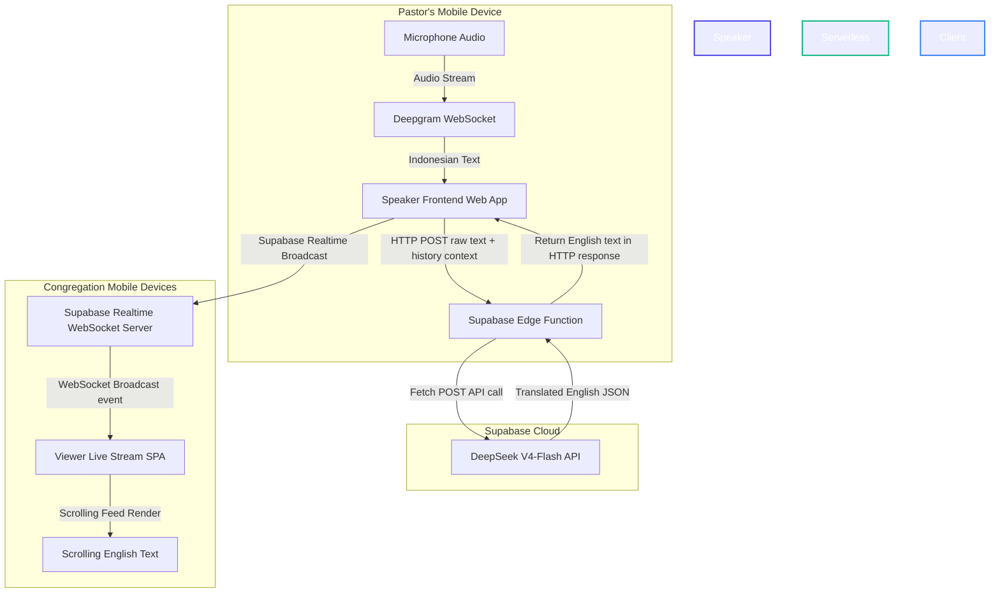
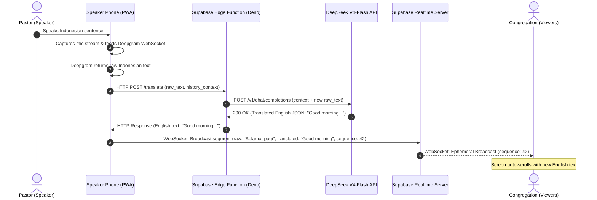

# System Architecture: Church Sermon Translation Pipeline (Zero-Storage Ephemeral)

This document defines the high-level architecture, communication protocols, sequence flow, and resilience strategies for the **0-Cost Real-Time Church Sermon Translation Pipeline (Indonesian → English)**.

## Architectural Overview

The system is designed to provide live, scrolling English text translations of spoken Indonesian church sermons to attendees' mobile devices. In alignment with our strict **$0 monthly infrastructure cost constraint**, the design leverages free-tier serverless offerings and completely eliminates database storage usage:
- **Speech-to-Text**: Processed client-side on the speaker's device by streaming microphone audio to **Deepgram** over WebSockets, returning transcribed Indonesian sentences instantly.
- **Compute (Translation Brain)**: A stateless Supabase serverless Edge Function (Deno) wraps the **DeepSeek V4-Flash API**, protecting API keys and translating the Indonesian text with history context.
- **Live Sync Broadcast**: The translated text is broadcasted ephemerally to all connected viewer devices using **Supabase Realtime Broadcast WebSockets** (using 0 bytes of Postgres database storage).
- **Hosting**: Static single-page application (Next.js) hosted on Vercel Free Tier.

## System Topology & Data Flow

### Communication Protocols
1. **Speaker App ↔ Deepgram**: Real-time WebSockets (`wss://`) streaming raw audio and receiving final transcripts.
2. **Speaker App → Supabase Edge Function**: Stateless HTTP POST request containing raw Indonesian text and context history.
3. **Supabase Edge Function → DeepSeek V4-Flash API**: HTTPS POST request over the public internet.
4. **Speaker App ↔ Supabase Realtime Server**: WebSocket connection (`wss://`) to broadcast ephemeral translation events.
5. **Supabase Realtime Server ↔ Viewer SPA**: WebSocket connections pushing live translations to the congregation within milliseconds.

---

## Detailed Sequence Diagram

The following sequence diagram outlines the end-to-end lifecycle of a single spoken sentence from utterance to display on the congregation's screens.

---

## Performance & Latency Targets

Given that church sermons are live, the latency between a pastor speaking a sentence and the translated text appearing on screen must remain under **2 seconds** to avoid a disconnected experience.

| Stage | Action / Component | Target Latency | Notes |
|---|---|---|---|
| **1** | Deepgram Streaming ASR | **0.2s – 0.3s** | Ultra-low latency voice-to-text; streaming audio chunks. |
| **2** | Translation Edge Function Cold Start | **0.0s – 0.4s** | Warm invocations take <20ms; cold starts take ~400ms. |
| **3** | DeepSeek V4-Flash API Inference | **0.6s – 1.0s** | Highly optimized LLM inference for low token length. |
| **4** | Realtime WebSocket Propagation | **0.05s – 0.1s** | Ephemeral broadcast is pushed instantly to all WebSocket nodes. |
| **Total**| **Voice-to-Screen Translation Loop** | **0.85s – 1.8s** | Average total loop latency sits around **1.3 seconds**, providing a seamless experience. |

---

## Resilience & Fault Tolerance

Since this architecture stores no state in a centralized database, the system is designed to handle issues gracefully:

### 1. Network Disruption (Speaker's Device)
- If the Wi-Fi/cellular connection drops, the ASR websocket connection will disconnect. The Speaker Console instantly updates its visual status indicator (turning red) and presents an error banner.
- The speaker can tap stop and start to re-establish the connection once network is restored.

### 2. Viewer Late Joins
- Since translations are broadcasted ephemerally, a viewer who joins mid-sermon will only see translations from their connection timestamp onward.
- The viewer UI displays a clean status indicator showing connection health and shows translated segments as they arrive.

